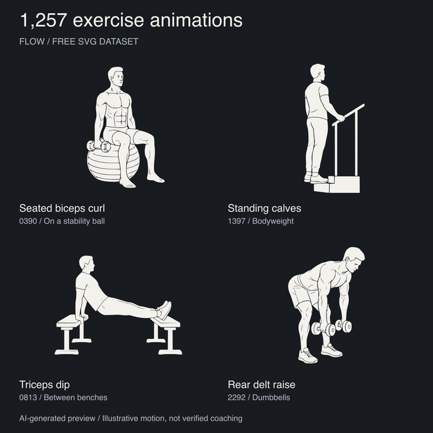

# Animation previews

These files render existing published SVG frames; they are not new artwork.
The grid shows IDs `0390`, `1397`, `0813`, and `2292` with shortened labels.
Full exercise names and instructions remain in `data/exercises.json`.



- [X attachment: square MP4](flow-exercises-x.mp4) — 1080 × 1080, 10.8 seconds, H.264, silent.
- [Animated grid GIF](flow-exercises.gif) — 720 × 720, loops automatically.
- [Still image / reduced-motion alternative](flow-exercises.png).
- Individual 480 × 480 GIFs: [seated biceps curl](0390.gif), [standing calves](1397.gif), [triceps dip](0813.gif), [rear delt raise](2292.gif).

Playback uses the dataset's original `0 → 1 → 2 → 1` sequence at 180 ms per
frame. Motion is illustrative, not a recommended exercise tempo. These are
AI-generated, unreviewed illustrations, not professionally verified coaching.
See the repository's [NOTICE](../NOTICE.md) and [artwork license](../ARTWORK-LICENSE).

## Rebuild

With Node.js 22+, FFmpeg on PATH, and the optional `sharp` dependency:

```sh
npm install --no-save --package-lock=false sharp
node scripts/build-previews.mjs
```

The base dataset validator does not need these rendering dependencies.
`sources.json` records the exact source SVG paths and SHA-256 hashes.
Generated temporary PNG frames stay in the operating system's temporary folder.
